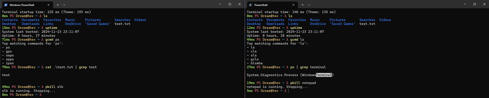

# Terminal Theme (with Oh My Posh)

## Preview

## Install & Update Oh My Posh

- Install: `winget install JanDeDobbeleer.OhMyPosh -s winget`
- Update: `winget upgrade JanDeDobbeleer.OhMyPosh -s winget`

## Fonts

- Navigate to the Nerd Fonts GitHub repository, proceed to the "Releases" section, and select a font for downloading from the most recent release.
  - [Nerd Fonts](https://github.com/ryanoasis/nerd-fonts/releases)
- I use **CascadiaCode**
- Navigate to the right-pointing arrow next to the new tab icon in the terminal -> settings -> Defaults -> Appearance -> under "Font face," you can opt for "CaskaydiaCove Nerd Font Mono" if desired

### Note

- Please set the font in the VsCode terminal to 'CaskaydiaCove Nerd Font Mono' for all profiles to ensure that certain characters are not displayed incorrectly (any nerd font will do the job)

## Oh My Posh Custom Theme

Template which inspired me: [Github Link](https://github.com/JanDeDobbeleer/oh-my-posh/blob/main/themes/emodipt-extend.omp.json)

### Documentation

The theme displays:
- Exit status indicator (✓ for success, ✗ with error code for failures)
- Command execution time (when > 500ms)
- Shell name
- User@Hostname
- Git branch name (simplified, with 15-minute cache for better performance)
- Current directory path
- Root indicator (!) when running as administrator
- Prompt symbol (λ)

#### Set The Theme

- `oh-my-posh init pwsh --config "$env:userprofile\Documents\TerminalThemes\oh-my-posh-theme.json" | Invoke-Expression`
- To ensure its persistence, append it to your profile file.

## Oh My Posh Default Themes

- `oh-my-posh init pwsh --config '$env:userprofile\emodipt-extend.omp.json' | Invoke-Expression`
